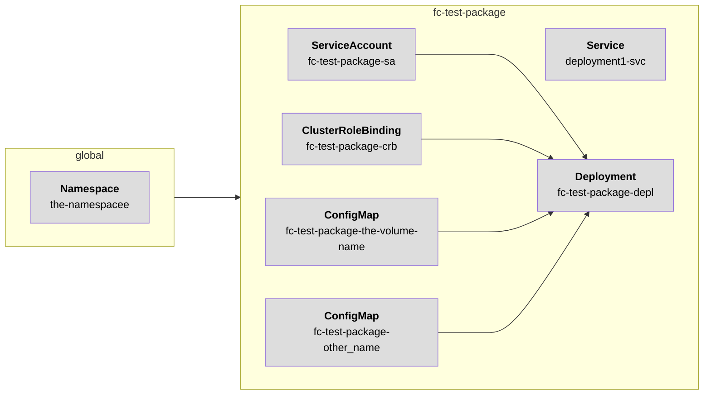
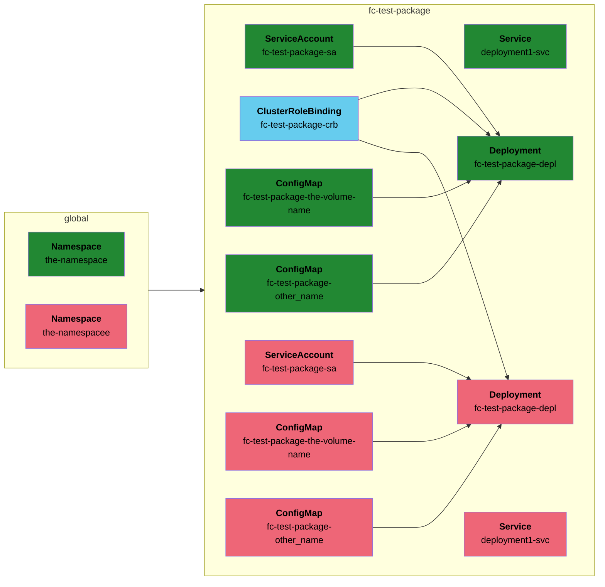

<figure markdown>
  
  <figcaption>Burn all the YAML.  Generated by Bing Image Creator with the prompt “fire yaml configuration”</figcaption>
</figure>


This past week, now that I'm done with grant proposals and such, I wanted to dive back into technical work, but I really
wasn't feeling excited about picking up SimKube again.  I wanted something that was a little more frivolous, so I
decided to pick up one of my toy side projects, 🔥Config.  You may recall that I [blogged about 🔥Config](./2023-08-07-doing-kubernetes-configuration-good.md)
way back in the beginning of my whole endeavour, and it's mostly been accomplishing what I wanted and staying out of my
way otherwise since then.  I've made a few small improvements, but the initial goal of "publish Kubernetes manifests
without having to deal with YAML" has been, I'd say, successful.

So why am I picking it back up again?  Well, for one, I think it's always important to have "fun" side projects to work
on, and I had some improvements that I wanted to make to it which should have just taken a day or two before I dove back
into the "real" work[^1].  But before we talk about what I did this week, let's revisit what 🔥Config is and what its goals
are.

## Stop Doing YAML

🔥Config is a tool for generating Kubernetes resource manifests from Python code.  It's build on top of [cdk8s](https://cdk8s.io),
which is an open-source "Cloud Development Toolkit" from AWS, and it's designed to make it easier to define your
Kubernetes applications.  Cdk8s is cool in and of itself, but as I described in my previous post, I don't think it goes
far _enough_.  So 🔥Config is my attempt to take Kubernetes YAML generation to the next level.

(As an aside, I'm a bit worried about my decision to base 🔥Config on cdk8s---there haven't been any commits to the
project by a human in 3+ months, and the issue tracker and PR page give all the appearances of a ghost town.  I really
hope AWS didn't just throw the project over the wall for some free press and then abandon it... Fortunately, it still
seems to work, barring a few annoyances, and if it becomes a problem in the future it should be possible to fork or
reimplement more sustainably[^2].)

You might ask why I'm not just using a pre-existing tool like [Helm](https://helm.sh/) or [Kustomize](https://kubectl.docs.kubernetes.io/guides/introduction/kustomize/)
for this instead of re-inventing the wheel, and part of the answer is "because it's fun", but the other part of the
answer is "because the existing tools we have for this are bad."  In his post about [the incidental complexity of
Kubernetes](https://www.xkyle.com/The-Incidental-Complexity-of-Kubernetes/), Kyle Anderson (a friend and former
colleague) says "k8s configuration, in YAML format, gives the illusion that the configuration is meant to be generated
and maintained by humans."  Kyle also links to a post from Lee Briggs (back in 2019, no less) called ["Why the fuck are
we templating yaml?"](https://leebriggs.co.uk/blog/2019/02/07/why-are-we-templating-yaml).  I've _also_ also seen a
large [number](https://hachyderm.io/@jakehamilton/111687881274342118) of [posts](https://hachyderm.io/@phrawzty/111770669330609918)
on [Mastodon](https://tech.lgbt/@chunked/111661135350850312) [complaining](https://hachyderm.io/@ellie/111324359328471600)
 about how bad YAML is for doing configuration.  I don't know of anyone in the industry who actually _likes_ dealing
with the large amount of YAML config required for Kubernetes.  So (in one of my enduring themes for ACRL) I'm trying to
use 🔥Config to show off a different way to do things[^3].

See, all application developers (and I'm including myself in that category for right now) want to do is "deploy their
damn app."  They don't want to have to think about "well this app needs some configuration, so I better create a
ConfigMap, and then create a Volume that loads the ConfigMap data and then make sure the Volume is mounted into the
container, and FML if I ever need to change the name of the ConfigMap or the mount location or any of that other
nonsense.  I need an app with some config.  Is that too much to ask?"

So with 🔥Config, I'm trying to reduce the stuff you have to think about when you deploy your app on Kubernetes to "the
app" and "the config" (or whatever it is your app actually needs).  However, at the end of the day, _something_ has to
generate the Kubernetes manifests, and for debuggability's sake, you need to know if the Kubernetes manifests you
generate are _correct_.  And that leads us to the impetus for the work I did this week.

## Just diff some files, how hard can it be?

It all started with a quick todo item I'd dashed off on my todo list for 🔥Config:

> Make 🔥config show a before/after diff

When I wrote this down, I'm pretty sure all I was thinking was "we made some changes to the app, how can we make sure
the Kubernetes manifests are correct?  Oh well, we've got the manifests before, and the manifests after, let's just diff
them and see what changed.  Should take a couple hours, tops."

Lol.

Well, that project ballooned into "Wouldn't it be great if we could actually have a [Terraform](https://www.terraform.io)-like
experience?  We should be able to easily visualize what Kubernetes resources have been created, deleted, or changed, and
even better, we should be able to tell if the changes we're making are going to cause pods to be recreated[^4].  And,
also, cdk8s lets you define dependencies between your resources so you can ensure they are created in the right order,
can't we just print the dependency graph?  And really, we ought to be able to do this automatically anytime anybody
makes a change to their app definitions, we can just have a GitHub action that dumps all the changes into a comment
anytime anyone opens a PR.  Easy, right?"

I feel like I've already buried the lede in this article quite a bit, but here, if you're still reading, take a look at
this.  I'm very proud of it.



The above graph[^5] shows all of the Kubernetes objects that get created for a simple Deployment.  If you're familiar with
Kubernetes, this shouldn't be too surprising, but what's cool here is that you can visually see all the dependencies.
The Deployment needs a namespace, a service account and role binding[^6], and then you can see it has two ConfigMaps
that get mounted in, as well as a Service so that other people can talk to the Deployment.  Pretty standard stuff.  The
yellow boxes here show how these resources are grouped together in the manifests[^7].

Here's the code that generates that:

```python
def _make_deployment():
    volumes = (fire.VolumesBuilder()
        .with_config_map("the-volume-name", "/mount/path", {"foo.yml": "bar"})
        .with_config_map("other_name", "/mount/path", {"bar.yml": "asdf"})
    )

    container = fire.ContainerBuilder(
        name="container1",
        image="test:latest",
        args=["/run.sh"],
    ).with_ports(GRPC_PORT).with_security_context(Capability.DEBUG).with_volumes(volumes)

    return (fire.DeploymentBuilder(app_label="deployment1")
        .with_containers(container)
        .with_service()
        .with_service_account_and_role_binding("cluster-admin", True)
        .with_node_selector("type", "kind-worker")
    )

class FCTestPackage(fire.AppPackage):
    def __init__(self):
        self._depl = _make_deployment()

    def compile(self, chart: Construct):
        self._depl.build(chart)

    @property
    def id(self):
        return "fc-test-package"

if __name__ == '__main__':
    fire.compile({
        "the-namespacee": [FCTestPackage()],
    }, 'dag.mermaid')
```

That's, like, ~35 lines of code, to generate 100 lines of YAML.  Granted, this is a pretty small app, but hopefully you
can imagine that the amount of YAML you'll generate will increase exponentially compared to the amount of Python you
have to write to configure your app in larger cases.  And, look---if you change the name of your ConfigMap volumes, all
that stuff just gets propagated through automagically, no more forgetting to change the name everywhere.

But wait!  I made a mistake!  There's a typo!  Save us!  I added an extra `e` at the end of the Namespace name!  Lemme
just correct that and re-push to master real quick, nobody will notice...



Oh, hell.  I forgot[^8] that when you change a namespace, you have to delete everything inside that namespace (the red
boxes) and recreate them in the new namespace (the green boxes).  Looks like maybe someone will notice after all.

Curiously, though, there's a nice blue box sitting in there, what's that?  Oh that's right, it's a _cluster_ role
binding, which means that object isn't namespace-scoped.  So we don't have to recreate that object, we just have to
change the namespace it refers to.

Anyways the diagram is nice and all, but it hides a fair amount of information.  Maybe you forgot that
ClusterRoleBindings aren't namespaced, and you want to see what the actual changes were.  Remember at the beginning when
I said we could just diff some files?  Well, it's not quite that easy but we can actually see the details of the changes
if we care:

**fc-test-package/fc-test-package-crb: Changed**

```
root['subjects'][0]['namespace']:
"the-namespacee" --> "the-namespace"
```

Here we can actually see, in a `terraform plan` style diff, the actual changes that were made to the role binding.  As
expected, we see that we're just updating the namespace for the role binding's subject.  And here's the coolest bit: I
wired it all up with GitHub actions so that whenever you make changes to your Kubernetes config, it spits out a [fun
little comment on the PR](https://github.com/acrlabs/simkube/pull/86#issuecomment-1909280701) showing you all the
changes!  Pretty awesome, right?

## No, not actually that awesome, I'm good, thanks.

I mean, OK, maybe it's not the most amazing demo on the planet, but I was proud of it, nonetheless.  And I'm unaware of
any other tool that does anything like this (I'm sure it exists _somewhere_, I can't be the first person to think of
this, but I've just never seen it before).  I had fun building it, and I learned some cool stuff along the way, so what
more can you really ask for, anyways?

Anyways, that's all I've got for now.  If you're interested in 🔥Config or you've used something similar in the past,
I'd love to hear about it!  Let me know in the comments below or [on Mastodon](https://hachyderm.io/@drmorr).  All the
code for this project can be found [on GitHub](https://github.com/acrlabs/fireconfig/), though as before, it should be
considered alpha software---anything can change at any moment for any reason, so maybe don't use it in production.

Thanks for reading,

~drmorr

[^1]: Famous last words.

[^2]: Not that I'm volunteering for that, no sir.  I've got other fish to fry.  Unless you want to pay me.  Then we can
    talk :D

[^3]: Is it a _better_ way to do things?  Well, I'm not gonna go that far, but... maybe?

[^4]: Have I complained about Kubernetes observability before?  One of the most common questions that infra engineers
    get is "Why did my pod go away?  This is a bug with your compute platform!!!"  And about 50% of the time the answer
    is "Oops, Cluster Autoscaler scaled down" and about 50% of the time the answer is "You deployed your service which
    recreated all the pods".

[^5]: The graph, by the way, is generated using [Mermaid](https://mermaid.js.org), which is a very cool textual graph
    description language.  _And_ it's supported natively by GitHub, which means we have all the tools need to make this
    a "real" CI tool.

[^6]: For some reason this deployment needs `cluster-admin` because we like to be insecure here at ACRL.

[^7]: Cdk8s calls these "charts" which I worry is confusing because mostly people talk about "Helm charts" when they
    talk about charts, but whatever, I'll use that terminology too.

[^8]: I did not forget, I'm just pretending I forgot for the purposes of the narrative.  Just go with it.
